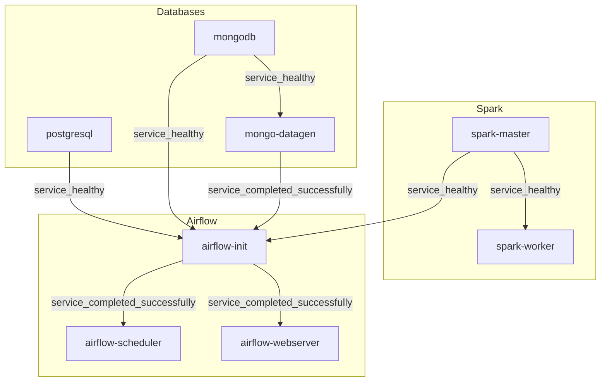

# Итоговое домашнее задание по модулю 3 дисциплины "ETL-процессы"

Проект представляет собой ***полностью автоматизированную*** систему обработки данных, разворачиваемую ***одной командой***. Конфигурация проекта облегчена для запуска на локальной машине.

### Стек
- **Airflow**: Оркестрация.
- **Spark**: Обработка данных.
- **PostgreSQL**: Реляционная СУБД-приемник.
- **MongoDB**: Нереляционная СУБД-источник.
- **Python**: Генератор данных для MongoDB.
- **Docker**: Контейнеризация сервисов.

### Важно
Проект рекомендуется запускать на устройстве с RAM>=8GB. Compose был спроектирован для минимально возможного потребления ресурсов, но из-за одновременно работающих сервисов Docker может занять более 4ГБ RAM.

## Автоматизация

Система состоит из 9 контейнеров:
1. PostgreSQL
2. MongoDB
3. mongo-express
4. Spark Master
5. Spark Worker
6. Генератор данных для MongoDB (mongo_datagen)
7. Airflow Init
8. Airflow Scheduler
9. Airflow Webserver

Все контейнеры основаны на открытых Docker Image. Они автоматически настраиваются и проверяют свою готовность с использованием Healthcheck. Система обеспечена скриптами для автоматической генерации данных, их репликации, создания и автообновления аналитических витрин.

### Идемпотентность

- Создание баз данных, пользователей, таблиц и выдача прав реализованы как идемпотентные операции, что гарантирует корректное повторное выполнение без дублирования.
- Генерация данных в MongoDB также идемпотентна: каждый запуск проверяет наличие ранее созданных данных и не выполняет повторную генерацию в случае их наличия.
- Все подключения и конфигурации в Airflow создаются автоматически при инициализации сервиса `airflow-init`, включая соединения, пользователей и базовый конфиг.

### Dependency Graph сборки

Каждая нода графа - отдельный сервис.



## Репликация данных
В Airflow реализована репликация данных из Mongo в PostgreSQL. DAG выполняет следующие задачи:
1. Извлечение данных из Mongo.
2. Трансформация данных через Spark.
3. Сохранение данных в PostgreSQL.

Репликация происходит в соответстующие таблицы в схеме `stg`.

## Аналитические витрины

Так как не имеет большого смысла вытаскивать данные из PG в Spark и последующей заливки обратно в тот же инстанс PG, для создания и обновления витрин используется встроенный функционал Postgres. Витрины представлены в виде materialized view для упрощения взаимодействия и обновления витрин одной командой по заданному расписанию.

В рамках DAG-ов реализована логика обновления витрин и их создания (если их нет или они были удалены) в отдельной схеме `cdm`.

### Ежедневная статистика пользовательских сессий (user_session_analysis)

#### Описание
Витрина для последующего анализа поведения пользователей - количества заказов и общей суммы затрат, разбитых по статусам заказов.

#### Поля и их описание

| Поле           | Описание                      |
|----------------|-------------------------------|
| user_id        | Идентификатор пользователя    |
| first_name     | Имя пользователя              |
| last_name      | Фамилия пользователя          |
| status         | Статус заказа                 |
| order_count    | Количество заказов            |
| total_spent    | Общая сумма затрат            |

### Витрина продаж продуктов (mart_product_sales)

#### Описание
Витрина для анализа активности пользователей на основе их сессий. Позволяет отслеживать количество сессий, среднюю продолжительность сессий и наиболее посещаемые страницы за каждый день. Может быть использована, например, для анализа поведения пользователей, выявления популярных страниц и оценки эффективности пользовательского опыта.

#### Поля и их описание
| Поле                   | Описание                          |
|------------------------|-----------------------------------|
| session_date             | Дата сессии (день)              |
| total_sessions                   | Общее количество уникальных сессий за день                   |
| avg_duration_sec                 | Средняя продолжительность сессии в секундах                     |
| most_visited_page    | Наиболее посещаемая страница за день |

### Витрина анализа ценовых изменений (price_analysis)

#### Описание
Витрина для анализа динамики цен на товары. Позволяет отслеживать текущую цену, дату последнего изменения цены и среднюю историческую цену для каждого товара. Может быть использована, например, для мониторинга ценовой политики, анализа трендов изменения цен и принятия решений о скидках или акциях.

#### Поля и их описание
| Поле               | Описание                               |
|--------------------|----------------------------------------|
| product_id             |  Идентификатор товара                         |
| current_price     | Текущая цена товара         |
| last_price_change      | Дата последнего изменения цены  |
| avg_price      | Средняя историческая цена товара  |

### Витрина метрик модерации отзывов (moderation_metrics)

#### Описание
Витрина для анализа процесса модерации отзывов. Позволяет отслеживать количество отзывов в различных статусах модерации (ожидающие, одобренные, с флагами) для каждого товара. Может быть использована, например, для контроля качества модерации, выявления проблемных товаров и анализа обратной связи от пользователей.

#### Поля и их описание
| Поле               | Описание                               |
|--------------------|----------------------------------------|
| product_id             |  Идентификатор товара                         |
| pending_reviews     | Количество отзывов на модерации         |
| approved_reviews      | Количество одобренных отзывов  |
| flagged_reviews      | Количество отзывов с флагами (проблемные)  |

## Сервисы и их конфигурация

### Управление конфигурацией
Вся конфигурация проекта управляется через единый файл `.env`, который содержит параметры для всех сервисов, включая логины, пароли, порты и настройки генерации данных.

### Доступы к данным и UI сервисов

#### PostgreSQL
- **URL**: `jdbc:postgresql://localhost:5432/postgres_finals_db`
- **Логин**: `finals_user`
- **Пароль**: `finals_pass`

#### mongo-express
- **URL**: `http://localhost:8082`
- **Логин**: `root`
- **Пароль**: `super_secret_root_pass`

#### Airflow Web UI
- **URL**: `http://localhost:8080`
- **Логин**: `admin`
- **Пароль**: `admin`

#### Spark Master
- **URL**: `http://localhost:8081`

### Генерация данных

#### Параметры генерации для MongoDB по умолчанию
  - Количество пользовательских сессий: 1000
  - Количество логов событий: 5000
  - Количество тикетов в поддержку: 300
  - Количество запросов в очереди на модерацию: 1000
  - Количество поисковых запросов: 2000

## Сборка, деплой и запуск DAG

1. Склонировать проект:
    ```
    git clone git@github.com:avshapoval/etl_finals.git
    ```
2. Перейти в корневую директорию проекта:
    ```
    cd etl_finals
    ```
3. Запустить команду:
    ```
    docker compose up --build [-d]
    ```
4. После сборки проекта и его развертывания будут доступны интерфейсы PostgreSQL, mongo-express, Airflow и Spark по указанным выше URL.
5. Все что остается сделать вручную после окончания деплоя - включить (переевсти в `unpaused`) DAG в UI Airflow. Т.к. используется `SequentialExecutor`, включать DAG-и необходимо последовательно:
    1. mongo_to_pg_full_replication
    2. cdm_materialized_views_refresh
